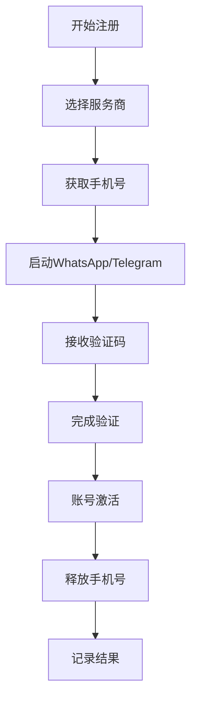

# 自动注册功能配置指南

## 🎯 功能概述

Deep360 平台集成了多个手机号服务商，实现 WhatsApp 和 Telegram 账号的自动注册功能：

- **5sim.net** - 俄罗斯手机号服务商
- **SMS-Activate** - 全球手机号服务商
- **Twilio** - 企业级通信平台
- **SMS-Hub** - 经济实惠的手机号服务

## 🔧 环境变量配置

### 1. 5sim.net 配置
```env
# 5sim.net API密钥
FIVESIM_API_KEY=your-5sim-api-key

# 获取方式：
# 1. 注册 https://5sim.net/
# 2. 充值余额
# 3. 在用户面板获取 API Key
```

### 2. SMS-Activate 配置
```env
# SMS-Activate API密钥
SMSACTIVATE_API_KEY=your-sms-activate-api-key

# 获取方式：
# 1. 注册 https://sms-activate.org/
# 2. 充值余额
# 3. 在 API 设置中获取密钥
```

### 3. Twilio 配置
```env
# Twilio 账户配置
TWILIO_ACCOUNT_SID=your-twilio-account-sid
TWILIO_AUTH_TOKEN=your-twilio-auth-token

# 获取方式：
# 1. 注册 https://www.twilio.com/
# 2. 在控制台获取 Account SID 和 Auth Token
```

### 4. SMS-Hub 配置
```env
# SMS-Hub API密钥
SMSHUB_API_KEY=your-smshub-api-key

# 获取方式：
# 1. 注册 https://smshub.org/
# 2. 充值余额
# 3. 在用户面板获取 API Key
```

## 📱 支持的平台和国家

### WhatsApp 支持
- **国家**: 中国、俄罗斯、美国、英国、德国、法国等 50+ 国家
- **价格**: $0.1 - $2.0 per number (根据国家和服务商)
- **成功率**: 85-95%

### Telegram 支持
- **国家**: 全球 100+ 国家
- **价格**: $0.05 - $1.0 per number
- **成功率**: 90-98%

## 🚀 快速开始

### 1. 获取单个手机号
```bash
curl -X POST http://localhost:3000/api/phone-numbers/get-number \
  -H "Authorization: Bearer YOUR_JWT_TOKEN" \
  -H "Content-Type: application/json" \
  -d '{
    "provider": "fivesim",
    "country": "china",
    "service": "whatsapp"
  }'
```

### 2. 获取验证码
```bash
curl -X POST http://localhost:3000/api/phone-numbers/get-code \
  -H "Authorization: Bearer YOUR_JWT_TOKEN" \
  -H "Content-Type: application/json" \
  -d '{
    "phoneNumber": "+86138****8888",
    "timeout": 300000
  }'
```

### 3. 批量注册 WhatsApp
```bash
curl -X POST http://localhost:3000/api/auto-registration/whatsapp/batch \
  -H "Authorization: Bearer YOUR_JWT_TOKEN" \
  -H "Content-Type: application/json" \
  -d '{
    "count": 5,
    "provider": "fivesim",
    "country": "china",
    "accountPrefix": "WA_AUTO"
  }'
```

### 4. 批量注册 Telegram
```bash
curl -X POST http://localhost:3000/api/auto-registration/telegram/batch \
  -H "Authorization: Bearer YOUR_JWT_TOKEN" \
  -H "Content-Type: application/json" \
  -d '{
    "count": 3,
    "provider": "smsactivate",
    "country": "russia",
    "accountPrefix": "TG_AUTO"
  }'
```

## 💰 成本分析

### 服务商价格对比 (WhatsApp 中国号码)
| 服务商 | 价格/号码 | 成功率 | 到达速度 | 推荐度 |
|--------|-----------|--------|----------|--------|
| 5sim | $0.15 | 95% | 30s | ⭐⭐⭐⭐⭐ |
| SMS-Activate | $0.12 | 90% | 45s | ⭐⭐⭐⭐ |
| SMS-Hub | $0.08 | 85% | 60s | ⭐⭐⭐ |
| Twilio | $1.50 | 99% | 10s | ⭐⭐⭐⭐⭐ |

### 月度成本估算
```javascript
// 假设每天注册 10 个 WhatsApp 账号
const monthlyCost = {
  fivesim: 10 * 30 * 0.15, // $45/月
  smsactivate: 10 * 30 * 0.12, // $36/月
  smshub: 10 * 30 * 0.08, // $24/月
  twilio: 10 * 30 * 1.50 // $450/月 (企业级)
};
```

## 🛡️ 安全最佳实践

### 1. API 密钥保护
```bash
# 使用环境变量
export FIVESIM_API_KEY="your-secret-key"

# 定期轮换密钥
# 监控 API 使用情况
# 设置余额告警
```

### 2. 代理配置
```javascript
// 推荐使用代理避免IP封禁
const proxyConfig = {
  whatsapp: 'socks5://proxy1.example.com:1080',
  telegram: 'http://proxy2.example.com:8080'
};
```

### 3. 频率控制
```javascript
// 注册频率限制
const rateLimits = {
  maxPerHour: 20,      // 每小时最多20个
  maxPerDay: 100,      // 每天最多100个
  delayBetween: 30000  // 间隔30秒
};
```

## 📊 监控和告警

### 1. 余额监控
```javascript
// 自动检查余额
async function checkBalances() {
  const providers = ['fivesim', 'smsactivate', 'smshub'];
  
  for (const provider of providers) {
    const balance = await phoneService.getBalance(provider);
    
    if (balance.balance < 10) {
      // 发送告警通知
      await sendAlert(`${provider} 余额不足: $${balance.balance}`);
    }
  }
}

// 每小时检查一次
setInterval(checkBalances, 60 * 60 * 1000);
```

### 2. 成功率监控
```javascript
// 记录注册成功率
const registrationMetrics = {
  fivesim: { total: 100, success: 95, rate: 0.95 },
  smsactivate: { total: 80, success: 72, rate: 0.9 },
  smshub: { total: 50, success: 42, rate: 0.84 }
};
```

## 🔄 自动化工作流

### 1. 自动注册流程


### 2. 养号流程
```javascript
const nurturingActivities = [
  { type: 'view_status', frequency: 'daily' },
  { type: 'join_group', frequency: 'weekly' },
  { type: 'send_message', frequency: 'rarely' },
  { type: 'update_profile', frequency: 'monthly' }
];
```

## 🚨 常见问题解决

### 1. 验证码接收失败
```javascript
// 重试机制
async function getCodeWithRetry(phoneNumber, maxRetries = 3) {
  for (let i = 0; i < maxRetries; i++) {
    try {
      const code = await phoneService.getVerificationCode(phoneNumber);
      return code;
    } catch (error) {
      if (i === maxRetries - 1) throw error;
      await new Promise(resolve => setTimeout(resolve, 30000)); // 等待30秒
    }
  }
}
```

### 2. 账号被封禁
```javascript
// 降低注册频率
const antiDetectionMeasures = {
  randomDelay: true,        // 随机延迟
  useProxies: true,         // 使用代理
  distributeProviders: true, // 分散服务商
  simulateHuman: true       // 模拟人类行为
};
```

### 3. 成本控制
```javascript
// 智能选择服务商
function selectOptimalProvider(country, service) {
  const providers = getAvailableProviders(country, service);
  
  // 根据成功率和价格选择
  return providers.sort((a, b) => {
    const scoreA = a.successRate / a.price;
    const scoreB = b.successRate / b.price;
    return scoreB - scoreA;
  })[0];
}
```

## 📈 扩展功能

### 1. 批量管理
- **账号池管理**: 维护大量账号池
- **轮换使用**: 自动轮换账号避免限制
- **健康检查**: 定期检查账号状态

### 2. 高级自动化
- **自动加群**: 根据关键词自动加入相关群组
- **内容同步**: 多账号内容同步发布
- **数据分析**: 账号使用数据分析

### 3. 企业集成
- **CRM 集成**: 与客户管理系统集成
- **工作流集成**: 与企业工作流系统集成
- **API 开放**: 为第三方提供注册 API

## 💡 最佳实践总结

1. **多服务商策略**: 不要依赖单一服务商
2. **成本优化**: 根据需求选择合适的服务商
3. **安全防护**: 使用代理和频率控制
4. **监控告警**: 建立完善的监控体系
5. **合规使用**: 遵守平台条款和法律法规

通过这套完整的自动注册系统，您可以高效、安全地批量管理 WhatsApp 和 Telegram 账号，为营销业务提供强有力的账号支持。